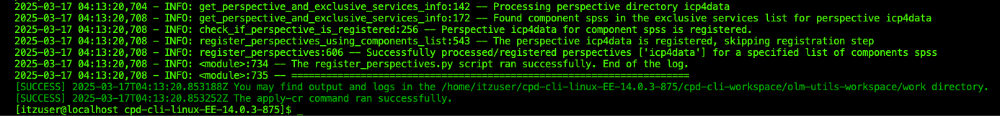

# Cloud Pak for Data v5.0.3 Installation Guide

##### This document aims to demonstrate how the installation of ``Cloud Pak for Data`` in the ``OpenShift v4.14`` environment was executed, installation and configuration of instances of ``Watson Studio, Watsonx.data, Watsonx.governance, SPSS Modeler, DataStage, DB2 and Cognos``.

## Prerequisites:
 - Have an OpenShift v4.14 cluster or higher.
 - Have an ``Entitlement Key``
 - Binary ``cpd-cli`` for environment variables.

## OpenShift Cluster Configuration


  Our cluster has 3 **control-planes/master-nodes** that are responsible for orchestrating and managing the cluster.
 
 - Api Server (**kube-apiserver**) -> responsible for processing API requests.
 - Controller Manager (**kube-controller-manager**) -> manages desired states of the objects in the cluster.
 - Scheduler (**kube-scheduler**) –> decides which nodes the Pods will run on.
 - ETCD – stores all the state data of the cluster.
 
**Workers**, in turn, are responsible for running workloads, which is where we install and configure **Cloud Pak for Data Pods, Deployments, and Services**.

**Storages**, on the other hand, are designed to act as storage nodes, because ``OpenShift Data Foundation (ODF)`` needs dedicated nodes to store and manage persistent volumes.

## Installing the IBM Cloud Pak for Data command-line interface **(cpd-cli)**

 To install the IBM Cloud Pak for Data software on your **RedHat® OpenShift® Container Platform** cluster, you must install the Cloud Pak for Data command-line interface ``(cpd-cli)`` on the workstation from which you are running the installation commands.  

#### Download version ``14.0.3`` of cpd-cli from the **IBM/cpd-cli** repository on GitHub. 
 Ensure that you download the correct package based on the Cloud Pak for Data license you purchased and the operating system on the customer's workstation:  
- Download the **Enterprise Edition**:


- Extract the contents of the file:
```
tar -xzvf cpd-cli-linux-EE-14.0.3.tgz
```

- Enter the directory and run unlimited commands to the ``cpd-cli`` file:
```
cd cpd-cli-linux-EE-14.0.3-875/
```

```
chmod 777 cpd-cli
```


## Podman Installation and Configuration

```
sudo yum install podman
```

```
sudo sysctl user.max_user_namespaces=15000
```

```
sudo usermod --add-subuids 200000-201000 --add-subgids 200000-201000 $(whoami)
```

```
grep $(whoami) /etc/subuid /etc/subgid
```

```
podman version
```


## Infra-nodes labeling and taint for OpenShift nodes/nodes

Nodes need to be labeled to identify their roles within the OpenShift cluster. The commands below label the ``storage-1``, ``storage-2``, and ``storage-3`` nodes as ``OpenShift Data Foundation (ODF)`` infrastructure and storage nodes.

### Labeling and Taint Commands for Nodes in **OpenShift**

Labeling the **storage-1** node for infrastructure and storage.

```
oc label node storage-1 node-role.kubernetes.io/infra=""
```
```
oc label node storage-1 cluster.ocs.openshift.io/openshiftstorage=""
```

Labeling the **storage-2** node for infrastructure and storage.

```
oc label node storage-2 node-role.kubernetes.io/infra=""
```

```
oc label node storage-2 cluster.ocs.openshift.io/openshiftstorage=""
```

Labeling the **storage-3** node for infrastructure and storage.

```
oc label node storage-3 node-role.kubernetes.io/infra=""
```

```
oc label node storage-3 cluster.ocs.openshift.io/openshiftstorage=""
```


## Applying Taints to Nodes to Control Pod Scheduling  

We then apply taints to nodes so that only storage workloads (such as OpenShift Data Foundation) can be scheduled on them. The following commands add the storage taint on the nodes.

Applying taint to the **storage-1** node for storage.

```
oc adm taint node storage-1 node.ocs.openshift.io/storage="true":NoSchedule
```

Applying taint to the **storage-2** node for storage.

```
oc adm taint node storage-2 node.ocs.openshift.io/storage="true":NoSchedule
```

Applying taint to the **storage-3** node for storage.

```
oc adm taint node storage-3 node.ocs.openshift.io/storage="true":NoSchedule
```


## Getting your IBM authorization API key for IBM Cloud Pak for Data
- To get your ``Entitlement Key:``
    - Log in to the software library in **My IBM** with **IBMid** (https://myibm.ibm.com/products-services/containerlibrary).
    - On the Entitlement keys tab, select Copy to copy the entitlement key to the clipboard.  


## Setting environment variables installation environment - (cpd_vars.sh)

Commands to install and upgrade ``IBM Cloud Pak for Data`` use variables with the format ``${VARIABLE_NAME}``. You can create a script to automatically export the appropriate values as environment variables before you run the installation commands. After you originate the script, you can copy most of the installation and update commands from the documentation and run them without making any changes.

```
#===============================================================================
# Cloud Pak for Data installation variables
#===============================================================================

# ------------------------------------------------------------------------------
# Client workstation
# ------------------------------------------------------------------------------
# Set the following variables if you want to override the default behavior of the Cloud Pak for Data CLI.
#
# To export these variables, you must uncomment each command in this section.

# export CPD_CLI_MANAGE_WORKSPACE=<enter a fully qualified directory>
# export OLM_UTILS_LAUNCH_ARGS=<enter launch arguments>


# ------------------------------------------------------------------------------
# Cluster
# ------------------------------------------------------------------------------

export OCP_URL=https://api.6792d68be4b091eaa609d26a.ocp.techzone.ibm.com:6443
export OPENSHIFT_TYPE=self-managed
export IMAGE_ARCH=amd64
export OCP_USERNAME=kubeadmin
export OCP_PASSWORD=<password to your OCP>
# export OCP_TOKEN=<enter your token>
export SERVER_ARGUMENTS="--server=${OCP_URL}"
export LOGIN_ARGUMENTS="--username=${OCP_USERNAME} --password=${OCP_PASSWORD}"
# export LOGIN_ARGUMENTS="--token=${OCP_TOKEN}"
export CPDM_OC_LOGIN="cpd-cli manage login-to-ocp ${SERVER_ARGUMENTS} ${LOGIN_ARGUMENTS}"
export OC_LOGIN="oc login ${SERVER_ARGUMENTS} ${LOGIN_ARGUMENTS}"


# ------------------------------------------------------------------------------
# Proxy server
# ------------------------------------------------------------------------------

# export PROXY_HOST=<enter your proxy server hostname>
# export PROXY_PORT=<enter your proxy server port number>
# export PROXY_USER=<enter your proxy server username>
# export PROXY_PASSWORD=<enter your proxy server password>


# ------------------------------------------------------------------------------
# Projects
# ------------------------------------------------------------------------------

export PROJECT_CERT_MANAGER=ibm-cert-manager
export PROJECT_LICENSE_SERVICE=ibm-licensing
# export PROJECT_SCHEDULING_SERVICE=<enter your scheduling service project>
# export PROJECT_IBM_EVENTS=<enter your IBM Events Operator project>
export PROJECT_PRIVILEGED_MONITORING_SERVICE=ibm-cpd-privileged
export PROJECT_CPD_INST_OPERATORS=ibm-operators
export PROJECT_CPD_INST_OPERANDS=ibm-cpd
# export PROJECT_CPD_INSTANCE_TETHERED=<enter your tethered project>
# export PROJECT_CPD_INSTANCE_TETHERED_LIST=<a comma-separated list of tethered projects>

# ------------------------------------------------------------------------------
# Storage
# ------------------------------------------------------------------------------

export STG_CLASS_BLOCK=ocs-storagecluster-ceph-rbd
export STG_CLASS_FILE=ocs-storagecluster-cephfs

# ------------------------------------------------------------------------------
# IBM Entitled Registry
# ------------------------------------------------------------------------------

export IBM_ENTITLEMENT_KEY=Entitlement Key>

# ------------------------------------------------------------------------------
# Private container registry
# ------------------------------------------------------------------------------
# Set the following variables if you mirror images to a private container registry.
#
# To export these variables, you must uncomment each command in this section.

# export PRIVATE_REGISTRY_LOCATION=<enter the location of your private container registry>
# export PRIVATE_REGISTRY_PUSH_USER=<enter the username of a user that can push to the registry>
# export PRIVATE_REGISTRY_PUSH_PASSWORD=<enter the password of the user that can push to the registry>
# export PRIVATE_REGISTRY_PULL_USER=<enter the username of a user that can pull from the registry>
# export PRIVATE_REGISTRY_PULL_PASSWORD=<enter the password of the user that can pull from the registry>

# ------------------------------------------------------------------------------
# Cloud Pak for Data version
# ------------------------------------------------------------------------------

export VERSION=5.0.3


# ------------------------------------------------------------------------------
# Components
# ------------------------------------------------------------------------------

export COMPONENTS=ibm-cert-manager,ibm-licensing,cpfs,cpd_platform
# export COMPONENTS_TO_SKIP=<component-ID-1>,<component-ID-2>


# ------------------------------------------------------------------------------
# watsonx Orchestrate
# ------------------------------------------------------------------------------
# export PROJECT_IBM_APP_CONNECT=<enter your IBM App Connect in containers project>
# export AC_CASE_VERSION=<version>
# export AC_CHANNEL_VERSION=<version>

```

- Save the file as a shell script. For example, save the file as ``cpd_vars.sh``.
- Confirm that the script does not contain any errors. For example, if you named the script ``cpd_vars.sh``, run:

```
bash ./cpd_vars.sh
```

- Provide the environment variables. For example, if you named the script ``cpd_vars.sh``, run:

```
chmod 777 cpd_vars.sh
```

```
source ./cpd_vars.sh
```

### Adding the command interface to the ``$PATH``

```
echo 'export PATH=/home/itzuser/cpd-cli-linux-EE-14.0.3-875:$PATH' >> ~/.bash_profile
```

```
echo 'source /home/itzuser/cpd-cli-linux-EE-14.0.3-875/cpd_vars.sh' >> ~/.bash_profile
```

```
source ~/.bash_profile
```
## Preparing the Cluster

#### Updating the global image extraction secret for IBM Cloud Pak for Data

The global image extraction secret ensures that your cluster has the necessary credentials to extract images. The credentials you add to the global image pull secret depend on where you want to pull images.

- Log in to your **OpenShift** cluster using ``cpd-cli``:

```
${CPDM_OC_LOGIN}
```


- Run the following command to provide your IBM authorization API key for the global image pull secret:

```
cpd-cli manage add-icr-cred-to-global-pull-secret \
--entitled_registry_key=${IBM_ENTITLEMENT_KEY}
```


## Installing shared cluster components for IBM Cloud Pak for Data

Before you can install IBM Cloud Pak for Data, you must install the IBM Cloud Pak Foundational Services certificate manager and license service. Optionally, you can install the Cloud Pak for Data scheduling service.

- Install the Certificate Manager and license service:

```
cpd-cli manage apply-cluster-components \
--release=${VERSION} \
--license_acceptance=true \
--cert_manager_ns=${PROJECT_CERT_MANAGER} \
--licensing_ns=${PROJECT_LICENSE_SERVICE}
```


## Preparing to install a Cloud Pak for Data instance

Before you can install IBM Cloud Pak for Data, you must create and configure projects for a Cloud Pak for Data instance.

#### Enforcing required permissions by running the command ``authorize-instance-topology``

Before installing an instance of ``IBM Cloud Pak for Data``, you must ensure that the project in which the operators will be installed can observe the project in which the control plane and services are installed. You can run the authorize-instance-topology command to apply the required permissions to the projects associated with a Cloud Pak for Data instance.

Run the command ``cpd-cli manage authorize-instace-topology`` to apply the necessary permissions to the projects.

```
cpd-cli manage authorize-instance-topology \
--cpd_operator_ns=${PROJECT_CPD_INST_OPERATORS} \
--cpd_instance_ns=${PROJECT_CPD_INST_OPERANDS}
```


## Installing a Cloud Pak for Data instance

You can install one or more ``IBM Cloud Pak for Data`` instances on your ``Red Hat® OpenShift® Container Platform cluster.`` Each Cloud Pak for Data instance has its own project for operators and its own project for the custom resources for the Cloud Pak for Data control plane and services (also called operands).

### Installing IBM Cloud Pak for Data foundational services

Before you can install the IBM Cloud Pak for Data control plane, you must install the fundamental IBM Cloud Pak services that Cloud Pak for Data requires. Each Cloud Pak for Data instance has its own instance of IBM Cloud Pak foundational services.

Run ``cpd-cli manage setup-instance-topology`` to install the core IBM Cloud Pak services and create the required ``ConfigMap``:

```
cpd-cli manage setup-instance-topology \
--release=${VERSION} \
--cpd_operator_ns=${PROJECT_CPD_INST_OPERATORS} \
--cpd_instance_ns=${PROJECT_CPD_INST_OPERANDS} \
--license_acceptance=true \
--block_storage_class=${STG_CLASS_BLOCK}
```


- Select the ``ibm-operators`` project:

```
oc project ibm-operators
```


## Installing IBM Cloud Pak for Data Control Plane

Review the license terms for the Cloud Pak for Data software that you plan to install. Licenses are available online. Run the appropriate commands based on the software you plan to install:

- 1. IBM Cloud Pak for Data Enterprise Edition.
```
cpd-cli manage get-license \
--release=${VERSION} \
--license-type=EE
```


- 2. Install operators in operators projects for the instance; IBM Cloud Pak for Data platform operator and service operators:

```
cpd-cli manage apply-olm \
--release=${VERSION} \
--cpd_operator_ns=${PROJECT_CPD_INST_OPERATORS} \
--components=${COMPONENTS}
```


- 3. Install the control plane in the instance's operand project; ``Red Hat OpenShift Data Foundation storage``:

```
cpd-cli manage apply-cr \
--release=${VERSION} \
--cpd_instance_ns=${PROJECT_CPD_INST_OPERANDS} \
--components=cpd_platform \
--block_storage_class=${STG_CLASS_BLOCK} \
--file_storage_class=${STG_CLASS_FILE} \
--license_acceptance=true
```


- 4. Confirm that the status of the operands is Completed:

```
cpd-cli manage get-cr-status \
--cpd_instance_ns=${PROJECT_CPD_INST_OPERANDS} \
--components=cpd_platform
```


- 5.	Confirm that the status of the operands is Completed:

```
cpd-cli manage get-cr-status \
--cpd_instance_ns=${PROJECT_CPD_INST_OPERANDS}
```


- 6.	It follows the ``cpd-cli`` commands to validate the operation of your ``Cloud Pak for Data`` implementation:

```
cpd-cli health operators \
--operator_ns=${PROJECT_CPD_INST_OPERATORS} \
--control_plane_ns=${PROJECT_CPD_INST_OPERANDS}
```


- 7.	Check the health of resources in the project of operators:

```
cpd-cli health operands \
--control_plane_ns=${PROJECT_CPD_INST_OPERANDS}
```


- 8.	Get the ``URL`` and credentials for the Cloud Pak for Data console:

```cpd-cli manage get-cpd-instance-details \
--cpd_instance_ns=${PROJECT_CPD_INST_OPERANDS} \
--get_admin_initial_credentials=true
```


## Login Console Cloud Pak for Data

Take the credentials ``(URL, username, and password)`` and log in to the IBM Cloud Pak for Data console:


#### Cloud Pak for Data Home:


### Installing Watson Studio instance

```
cpd-cli manage apply-olm \
--release=${VERSION} \
--cpd_operator_ns=${PROJECT_CPD_INST_OPERATORS} \
--components=ws
```

```
cpd-cli manage apply-cr \
--components=ws \
--release=${VERSION} \
--cpd_instance_ns=${PROJECT_CPD_INST_OPERANDS} \
--block_storage_class=${STG_CLASS_BLOCK} \
--file_storage_class=${STG_CLASS_FILE} \
--license_acceptance=true
```

```
cpd-cli manage get-cr-status \
--cpd_instance_ns=${PROJECT_CPD_INST_OPERANDS} \
--components=ws
```


### Installing DataStage instance

```
cpd-cli manage apply-olm \
--release=${VERSION} \
--cpd_operator_ns=${PROJECT_CPD_INST_OPERATORS} \
--components=ws
```


```
cpd-cli manage apply-cr \
--components=ws \
--release=${VERSION} \
--cpd_instance_ns=${PROJECT_CPD_INST_OPERANDS} \
--block_storage_class=${STG_CLASS_BLOCK} \
--file_storage_class=${STG_CLASS_FILE} \
--license_acceptance=true
```


### Installing Machine Learning instance

```
cpd-cli manage apply-olm \
--release=${VERSION} \
--cpd_operator_ns=${PROJECT_CPD_INST_OPERATORS} \
--components=wml
```


```
cpd-cli manage apply-cr \
--components=wml \
--release=${VERSION} \
--cpd_instance_ns=${PROJECT_CPD_INST_OPERANDS} \
--block_storage_class=${STG_CLASS_BLOCK} \
--file_storage_class=${STG_CLASS_FILE} \
--license_acceptance=true
```


```
cpd-cli manage get-cr-status \
--cpd_instance_ns=${PROJECT_CPD_INST_OPERANDS} \
--components=wml
```


### Installing SPSS Modeler instance

```
cpd-cli manage apply-olm \
--release=${VERSION} \
--cpd_operator_ns=${PROJECT_CPD_INST_OPERATORS} \
--components=spss
```


```
cpd-cli manage apply-cr \
--components=spss \
--release=${VERSION} \
--cpd_instance_ns=${PROJECT_CPD_INST_OPERANDS} \
--license_acceptance=true
```



```
cpd-cli manage get-cr-status \
--cpd_instance_ns=${PROJECT_CPD_INST_OPERANDS} \
--components=spss
```


#### Installing Watsonx Governance instance

```
cpd-cli manage apply-olm \
--release=${VERSION} \
--cpd_operator_ns=${PROJECT_CPD_INST_OPERATORS} \
--components=watsonx_governance
```


```
cpd-cli manage apply-cr \
--components=watsonx_governance \
--release=${VERSION} \
--cpd_instance_ns=${PROJECT_CPD_INST_OPERANDS} \
--block_storage_class=${STG_CLASS_BLOCK} \
--file_storage_class=${STG_CLASS_FILE} \
--license_acceptance=true
```


```
cpd-cli manage get-cr-status \
--cpd_instance_ns=${PROJECT_CPD_INST_OPERANDS} \
--components=watsonx_governance
```


#### Installing DB2 instance

```
cpd-cli manage apply-olm \
--release=${VERSION} \
--cpd_operator_ns=${PROJECT_CPD_INST_OPERATORS} \
--components=db2oltp
```


```
cpd-cli manage apply-cr \
--components=db2oltp \
--release=${VERSION} \
--cpd_instance_ns=${PROJECT_CPD_INST_OPERANDS} \
--license_acceptance=true
```


```
cpd-cli manage get-cr-status \
--cpd_instance_ns=${PROJECT_CPD_INST_OPERANDS} \
--components=db2oltp
```


#### Installing Watsonx Data instance

```
cpd-cli manage apply-olm \
--release=${VERSION} \
--cpd_operator_ns=${PROJECT_CPD_INST_OPERATORS} \
--components=watsonx_data
```


```
cpd-cli manage apply-cr \
--components=watsonx_data \
--release=${VERSION} \
--cpd_instance_ns=${PROJECT_CPD_INST_OPERANDS} \
--block_storage_class=${STG_CLASS_BLOCK} \
--file_storage_class=${STG_CLASS_FILE} \
--license_acceptance=true
```


```
cpd-cli manage get-cr-status \
--cpd_instance_ns=${PROJECT_CPD_INST_OPERANDS} \
--components=watsonx_data
```


